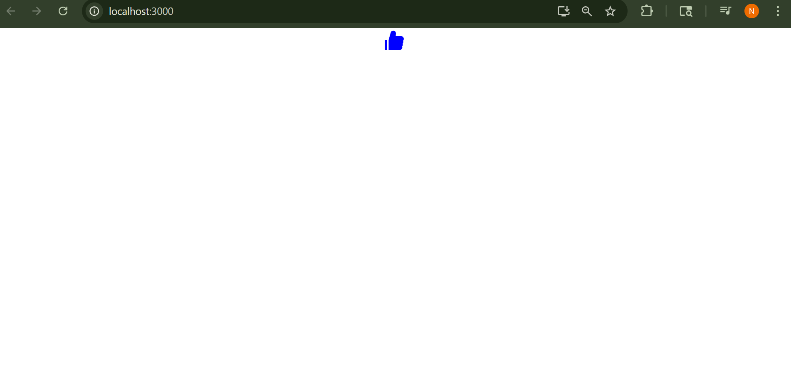

#Like / Dislike Button – React Project

This is a simple React project that demonstrates a **toggleable Like/Dislike button** using icons from `react-icons`. Clicking the icon toggles the state between "Liked" and "Disliked", updating both the icon and the message.

---

##  Demo



---

## Features

- Toggle between Like and Dislike
- State management using `useState` hook
- Icon feedback using `react-icons`

---

## Tech Stack

- React (Functional Components)
- JavaScript (ES6+)
- React Icons

---

## 📦 Installation & Run Locally

1. **Clone the repo:**

   ```bash
   git clone https://github.com/tnikhilchowdary/like-dislike-button.git
   cd like-dislike-button

